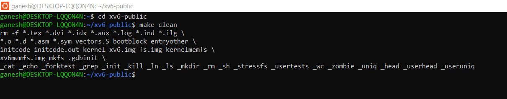
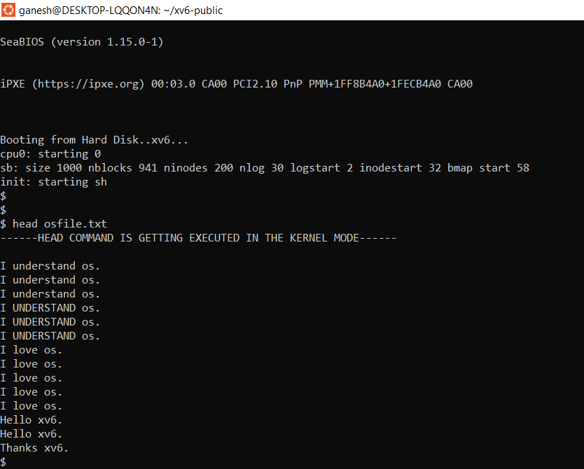
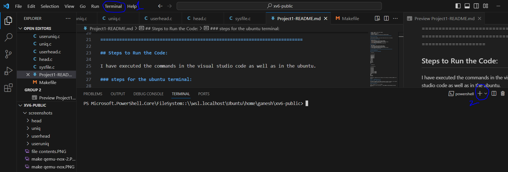
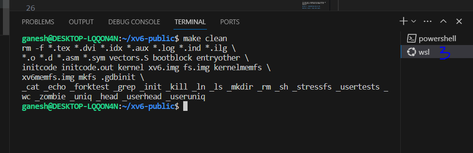
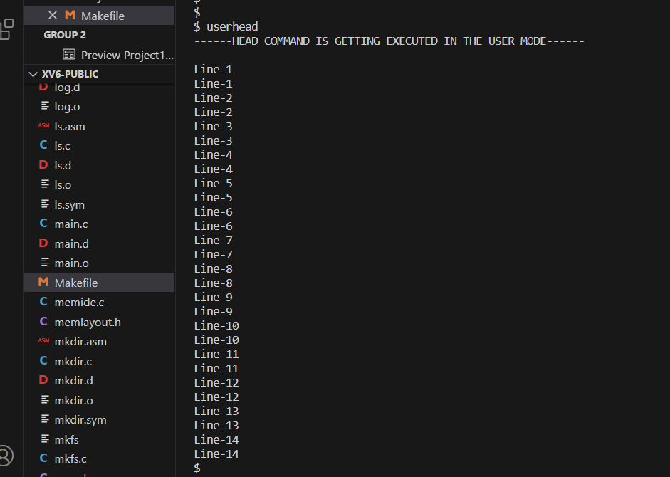
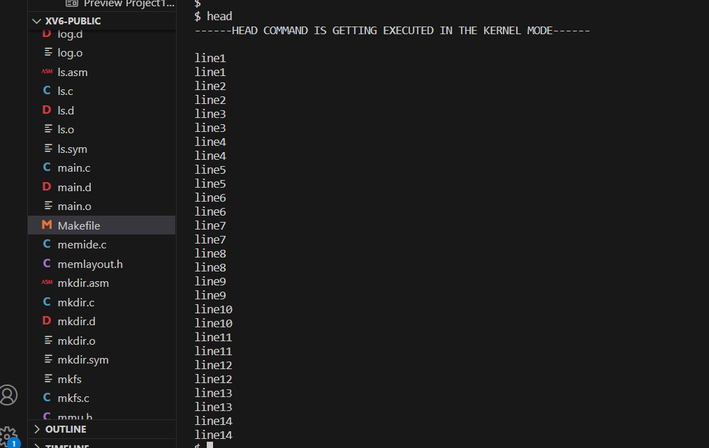

## System Specifications:

### Device Specifications:

1. Device name DESKTOP-LQQON4N
2. Processor Intel(R) Core(TM) i5-10200H CPU @ 2.40GHz 2.40 GHz
3. Installed RAM 16.0 GB (15.8 GB usable)
4. Device ID B8BC3905-999D-466B-B7A1-6063FD2E3420
5. Product ID 00327-35930-55360-AAOEM
6. System type 64-bit operating system, x64-based processor
7. Pen and touch No pen or touch input is available for this display

### Windows Specifications:

1. Edition : Windows 10 Home Single Language
2. Version : 22H2
3. Installed on ‎25-‎02-‎2022
4. OS build : 19045.3448
5. Experience : Windows Feature Experience Pack 1000.19044.1000.0

===========================================================================

## Steps to Run the Code:

I have executed the commands in the visual studio code as well as in the ubuntu.

### steps for the ubuntu terminal:

1. open the ubuntu.
2. navigate to xv6-public directory using cd command.
   
3. run make clean and make qemu-nox commands to invoke the shell.
4. run the commands for uniq and head.
   

### steps for vscode:

1. open vscode.
2. open xv6-public folder using open folder option.
3. On the top select "terminal" and open new terminal.
   
4. select the Ubuntu(WSL) terminal from the options.
5. run make clean and make qemu-nox commands to invoke the shell.
   
6. run the commands for uniq and head.

==============================================================================

# User Mode Implementation:

### The text files we are considering:

1. osfile.txt

```
> cat osfile.txt

I understand os
I understand os
I understand os
I UNDERSTAND os
I UNDERSTAND os
I UNDERSTAND os
I love os
I love os
I love os
I love os
I love os
Hello xv6
Hello xv6
Thanks xv6
Bye
```

2. nextfile.txt

```
> cat nextfile.txt

I love music.
I love music.
I love music.
I love music.
I love music.
I love music.
I love music.
I love music of Ganesh.
I love music of Ganesh.
I love music of Ganesh.
I love music of Ganesh.
Thanks.
Bye.
Bye.
Take Care.
Take Care.
```

for each user c program file we are creating, we are including in the EXTRA and UPROGS in the Makefile.

## Part 1 - Implementing uniq on xv6.

### Part 1 Task-1 - Uniq: User space:

The program to implement 'uniq' command in userspace is written in 'useruniq.c' file. Therefore to test the userspace implementation we need to use the command "useruniq".

#### Logic and Execution:

syntax : useruniq [-c or -d or -i] filename

The execution will start from printing "------UNIQ COMMAND IS GETTING EXECUTED IN THE USER MODE------".

#### 1. useruniq filename

After executing the above command in the terminal, based on command line arguments argc=2, argv[0]="uniq" and argv[1]="osfile.txt"
and file should be in sorted order for uniq.


#### 2. useruniq -c filename

#### 3. useruniq -d filename

#### 4. useruniq -i filename

To deal with the options(-c,-i,-d) we are using "options" variable
for 2,3,4 commands the argc=3 and those three arguments can be retreived using argv[]
here for (argc==3), to track the respective option the "option" variable will store the values 1,2,3 for -c,-d,-i options respectively.

if the arguments are greater than 3 then we are displaying the correct syntax for our implementation.

The file to be opened for reading the contents will get from command line and respective error handling when it fails to open the file(if file not exists) is executed when file descriptor has value<0.


#### 5. cat filename | uniq

for the 5th command the argc==1 and the file contents need to be read will be in the standard input which has the file descriptor(fd) value=0.
for this case we are considering fd=0 as we are reading from standard input and for other cases "fd" will have the value returned from open(osfile.txt,O_RDONLY).

After opening the file we are running a while() loop to read the contents of the file character by character and when we encountered a new line we are comparing with previous line for duplication.
if the previous line is same as current line then it will check with that and go with next line. if the previous line is not same as current one then we will print the previous line and now the previous line will point to current line and this process will go until the last line.

for the "-i" option we are changing the both lines to upper case and comapring the lines as we are ignoring the case.
for the "-c" option we are incrementing the frequency if we encounter any duplicate and printing the count and line when a new different line is encountered.
for the "-d" option we are maintaing a duplicate_line and it will set to 1, when there is a duplicate line and same as "-c" we are printing the duplicate line when a new different line is encountered.

To handle the final lines in the file we will exit from the while loop and based on the values of frequency and duplicate_line we are printing the lastline.


## Part 2 - Implementing head on xv6.

### Part 2 Task-1 - head: User space:

The program to implement 'head' command in userspace is written in 'userhead.c' file. Therefore to test the userspace implementation we need to use the command "userhead".

#### Logic and Execution:

syntax : userhead [-n N] file1 file2....

The execution will start from printing "------HEAD COMMAND IS GETTING EXECUTED IN THE USER MODE------".
the default number of lines to print is set to 14 and we will change this if we use -n option with desired number of lines.

#### 1. userhead

for this command we are using std_head() and inside this we are reading the input from standard input(fd=0) and printing the same on the output. This will continue until we read and print 14 lines from the standard input.



#### 2. userhead file1 file2 .....

for this command the argc will be >=2 and checking whether the second argument is "-n" or not(strcmp(argv[1],"-n") should not equal to 0 here). this condition will check that the command should be in above format.
for each file we are iterating loop first to print the ====>filename<==== and inturn it will call user_head() to print the content for each file.

if we are unable to open the file and if the file not exists then it will display error message.


#### 3. userhead -n N file1 file2 .....

for this command the argc will be >=4 and checking whether the second argument is "-n" or not(strcmp(argv[1],"-n") should be equal to 0 here).this condition will check that the command should be in above format.

if the third argument is other than Number then it will display the error message by outputting the correct syntax.

for each file we are iterating loop first to print the ====>filename<==== and inturn it will call user_head() to print the content for each file. here using 'N' we are printing userdefined number lines to standard output.


#### 4. cat filename | userhead


# Kernel Mode Implementation:

### For implementing the system calls for uniq and head we need to modify some files:

#### 1. syscall.h

By default there will be 21 system calls and we are adding 2 system calls sys_head() and sys_uniq(). Therefore in syscall.h we are adding those 2.

#### 2. syscall.c

Here we are adding function pointer to the system call and declaring the function prototype with extern scope as we are not defining here.

#### 3. uys.S

it will acts as a interface for the system calls and we are adding SYSCALL(head) and SYSCALL(uniq) here.additional to existing system calls.

#### 4. user.h

Here we are declaring the function with arguments and return type as we need to pass the arguments to system call regarding file information and options etc.

#### 5. sysfile.c

The implementation of system calls is done here.( we can even use sysproc.c which also contains system calls)

### Retreiving arguments and file contents in kernel mode:

To retreive the arguments in the kernel mode which are passing from user space we are using argint() and argstr() for integer and string values respectively.
eg: argint(0,&fd)- will read the first argument and store it in 'fd' variable.

### Accessing the File in Kernel mode:

In this we are using process control block structure to retreive the open files in the current process and using file descriptor value we can easily know the file we need to retreive using the index of ofile[].

struct proc *curproc = myproc()
struct proc *f=curproc->ofile[fd]

using the file pointer we are getting inode which has the complete structure and information about the file.

struct inode\* ip
ip=f->ip

and we need to lock the file resource to prevent any modifications and unlock after completeing the operation.
ilock(ip)
unlock(ip)

Here in the kernel mode we are using readi(ip,buf,offset,bufsize) to read the contents of the file.

### Part 1 Task-2 - uniq: Kernel space:

The program to implement 'uniq' command in kernel space is written in 'uniq.c' file. Therefore to test the kernel space implementation we need to use the command "uniq".

#### Logic and Execution:

syntax : uniq [-c or -d or -i] filename

The execution will start from printing "------UNIQ COMMAND IS GETTING EXECUTED IN THE KERNEL MODE------".

The logic is same as usermode except we are using sys_uniq() function that is written in the kernel mode inside the sysfile.c file along with other system calls which are already existed. After retreiving the arguments and getting the inode for file we have written while loop as we did in the usermode for all cases.

#### 1. uniq filename


#### 2. uniq -c filename


#### 3. uniq -d filename


#### 4. uniq -i filename


#### 5. cat filename | uniq


### Part 2 Task-2 - head: Kernel space:

The program to implement 'head' command in userspace is written in 'head.c' file. Therefore to test the userspace implementation we need to use the command "head".

#### Logic and Execution:

syntax : head [-n N] file1 file2....

The execution will start from printing "------HEAD COMMAND IS GETTING EXECUTED IN THE KERNEL MODE------".

The logic is same as usermode except we are using sys_head() function that is written in the kernel mode inside the sysfile.c file instead of user_head() which is used for user mode along with other system calls which are already existed.

In sys_head() we are retreiving the arguments that sent from head.c as discussed in retreiving arguments section.

In sys_head() we are using while loop to read byte by byte and displaying the content of the line when a new line is encountered and incrementing the lines printed. this will continue until printing the required number of lines.

#### 1. head



#### 2. head file1


#### 3. head file1 file2 ...


#### 4. head -n N file1


#### 5. head -n N file1 file2 ...


#### 6. cat filename | head


======================================================================================

## Resources:

online resources:
Lecture Videos of XV6: https://www.cse.iitb.ac.in/~mythili/os/
(helpful in understanding the xv6 concepts and existing code of xv6. mainly Processes in xv6, Process management system calls in xv6, Trap handling in xv6, Scheduling and context switching in xv6, User process creation in xv6)

Xv6 Operating System -adding a new system call: https://www.geeksforgeeks.org/xv6-operating-system-adding-a-new-system-call/
(helped in understanding about how to implement a system call in xv6 operating system)

Xv6 Operating System -add a user program : https://www.geeksforgeeks.org/xv6-operating-system-add-a-user-program/
(helped in understanding about how to add a user program in xv6 OS)

Uniq Functionality: https://www.redhat.com/sysadmin/uniq-command-lists
Uniq Functionality: https://www.javatpoint.com/linux-uniq
Uniq Lecture : https://youtu.be/k2k1LaKsAWI
(helped to understand the functionality of uniq command in linux)

Head Command : https://www.baeldung.com/linux/head-tail-commands
Head Command: https://linuxhint.com/linux-head-command-with-examples/
Head Lecture : https://youtu.be/ZZACz-filWU
(helped to understand the functionality of head command in linux)

Teaching Assistant:
clarified the doubt regarding how to keep both user and kernel code by suggesting to give a different command to user mode code (eg: uniquser <fname> for usermode and uniq <fname> for kernel mode)
